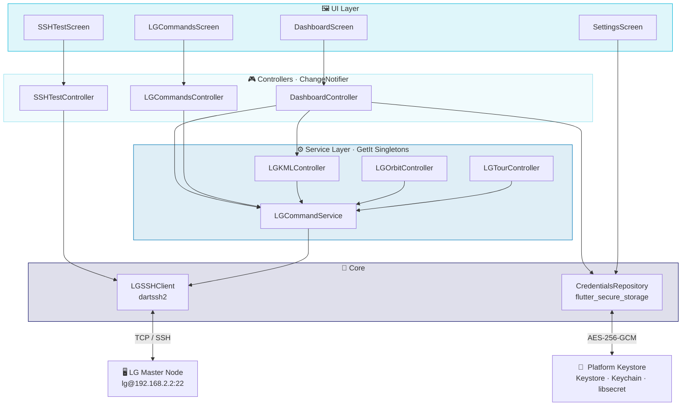
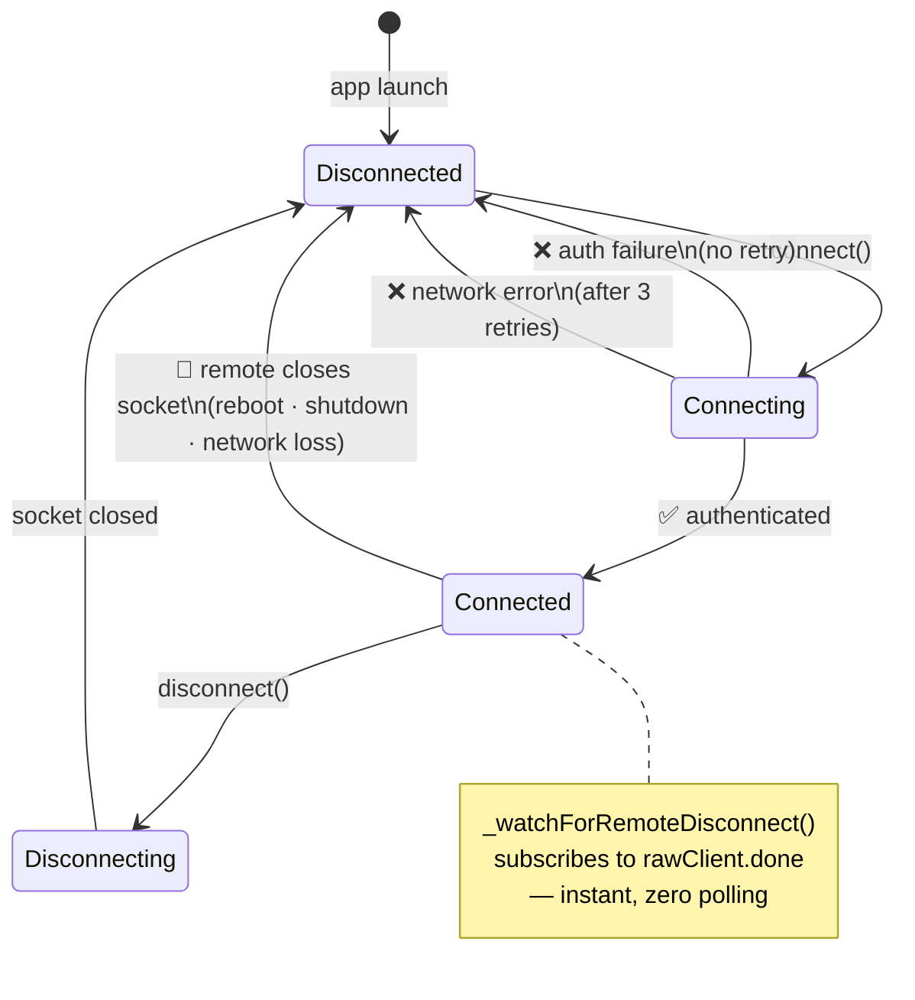
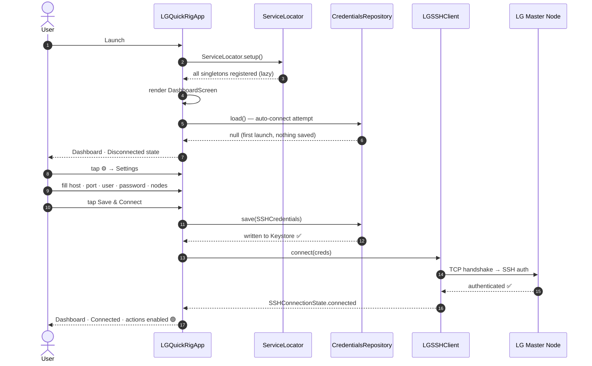
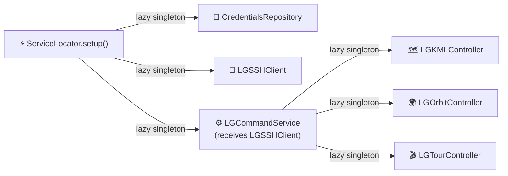

<div align="center">

```
██╗      ██████╗      ██████╗ ██╗   ██╗██╗ ██████╗██╗  ██╗██████╗ ██╗ ██████╗
██║     ██╔════╝     ██╔═══██╗██║   ██║██║██╔════╝██║ ██╔╝██╔══██╗██║██╔════╝
██║     ██║  ███╗    ██║   ██║██║   ██║██║██║     █████╔╝ ██████╔╝██║██║  ███╗
██║     ██║   ██║    ██║▄▄ ██║██║   ██║██║██║     ██╔═██╗ ██╔══██╗██║██║   ██║
███████╗╚██████╔╝    ╚██████╔╝╚██████╔╝██║╚██████╗██║  ██╗██║  ██║██║╚██████╔╝
╚══════╝ ╚═════╝      ╚══▀▀═╝  ╚═════╝ ╚═╝ ╚═════╝╚═╝  ╚═╝╚═╝  ╚═╝╚═╝ ╚═════╝
```

### Flutter-based Android + Linux companion app for Liquid Galaxy.

<br/>

[](https://flutter.dev)
[](https://dart.dev)
[](https://developer.android.com)
[](https://flutter.dev/multi-platform/linux)
[](LICENSE)

<br/>

[](https://pub.dev/packages/dartssh2)
[](https://pub.dev/packages/flutter_secure_storage)
[](https://pub.dev/packages/get_it)
[](https://ai.google.dev)

</div>

---

## What is LG QuickRig?

**Liquid Galaxy** is an open-source multi-display platform that renders synchronised panoramic views across a rig of 3–9 Linux machines running Google Earth. Managing it normally means SSH-ing into the master node every single time.

**LG QuickRig** eliminates that friction — control your entire Liquid Galaxy cluster from your Android home screen or Linux desktop without opening a terminal. One tap to reboot, sync, blank screens, or restart slaves. AI-powered voice commands and Gemini-driven log monitoring take it further: speak to your rig and let the system detect anomalies before they become incidents.

---

## App Preview

> Dashboard · LG Commands · SSH Console — dark teal Material 3 theme

```
╔═══════════════════════════════════════════╗   ╔═══════════════════════════════════════════╗
║  LG QuickRig          ● Connected  ⚙     ║   ║  LG Commands          ● Connected        ║
╠═══════════════════════════════════════════╣   ╠═══════════════════════════════════════════╣
║                                           ║   ║  ┌─────────────────────────────────────┐  ║
║  ┌─────────────────────────────────────┐  ║   ║  │ ● Connected — ready to send commands│  ║
║  │ Connection                          │  ║   ║  └─────────────────────────────────────┘  ║
║  │ lg@192.168.2.2  ·  3 nodes         │  ║   ║                                           ║
║  │ ╔═════════════════════════════════╗ │  ║   ║  Commands                                 ║
║  │ ║         ◈  Disconnect          ║ │  ║   ║  ┌───────────────┐  ┌───────────────────┐ ║
║  └─────────────────────────────────────┘  ║   ║  │ 🔄 Reboot    │  │ ⚡ Shutdown       │ ║
║                                           ║   ║  └───────────────┘  └───────────────────┘ ║
║  Quick Actions                            ║   ║  ┌───────────────┐  ┌───────────────────┐ ║
║  ┌───────────────┐  ┌───────────────────┐ ║   ║  │ ↻  Sync      │  │ 🔁 Restart Slaves │ ║
║  │ 🔄 Reboot    │  │ 🔁 Restart Svcs   │ ║   ║  └───────────────┘  └───────────────────┘ ║
║  └───────────────┘  └───────────────────┘ ║   ║  ┌───────────────┐                       ║
║  ┌───────────────┐  ┌───────────────────┐ ║   ║  │ 📺 Blank Scrn │                       ║
║  │ ⚡ Shutdown  │  │ ↻  Sync           │ ║   ║  └───────────────┘                       ║
║  └───────────────┘  └───────────────────┘ ║   ║                                           ║
║  ┌───────────────┐  ┌───────────────────┐ ║   ║  Output                        [Clear]    ║
║  │ 📺 Blank Scrn│  │ 🗑 Clean KML      │ ║   ║  ┌─────────────────────────────────────┐ ║
║  └───────────────┘  └───────────────────┘ ║   ║  │14:32:01 [OUT] Running: Sync…        │ ║
║  ┌───────────────┐  ┌───────────────────┐ ║   ║  │14:32:02 [OUT] Sync completed.       │ ║
║  │ ⌨ LG Cmds   │  │ >_  SSH Console   │ ║   ║  └─────────────────────────────────────┘ ║
║  └───────────────┘  └───────────────────┘ ║   ╚═══════════════════════════════════════════╝
╚═══════════════════════════════════════════╝             LG Commands Screen
              Dashboard
```

---

## Features

| | Feature | Status |
|---|---|---|
| 🔌 | Secure SSH transport — timeout, retry (×3), auto-reconnect | ✅ Done |
| 🔐 | Encrypted credential storage (Keystore / Keychain / libsecret) | ✅ Done |
| 📊 | Dashboard with live connection-status badge | ✅ Done |
| ⚡ | Predefined commands — Reboot, Shutdown, Sync, Restart Slaves, Blank Screens | ✅ Done |
| 💻 | SSH Console — raw command input with timestamped log | ✅ Done |
| ⌨️ | LG Commands screen — preset buttons + output log + connection status | ✅ Done |
| ⚙️ | Settings screen — self-loading, secure-enclave persistence | ✅ Done |
| 🗺️ | KML file management on the master HTTP server | ✅ Done |
| 🌍 | Orbit / FlyTo via `gx:FlyTo` KML + `LookAt` | ✅ Done |
| 🎬 | Tour control via `gs_cmd` mechanism | ✅ Done |
| 📱 | Android Command Bar home-screen widget (4×1) | 🔜 Week 2 |
| 🔔 | Android Quick Settings tile (one-tap from notification shade) | 🔜 Week 2 |
| 📡 | Android Live Status home-screen widget (2×2) | 🔜 Week 3 |
| 🔧 | Background service — persistent SSH engine for widgets | 🔜 Week 3 |
| 🖥️ | Linux desktop build — same Flutter codebase | 🔜 Week 4 |
| 🎙️ | AI voice commands — speak to your rig | 🔜 Week 5 |
| 🤖 | Gemini API integration for natural-language SSH control | 🔜 Week 5 |
| 📋 | Gemini-powered SSH log monitoring + anomaly detection | 🔜 Week 6 |
| 📐 | Adaptive widget layout driven by AI | 🔜 Week 6 |

---

## Architecture



---

## SSH Connection State Machine



---

## First-launch Flow



---

## Project Structure

```
lg_quickrig/
│
├── 📱 android/app/src/main/
│   ├── AndroidManifest.xml          ← INTERNET permission · widget/tile stubs
│   ├── kotlin/…/
│   │   ├── MainActivity.kt          ← wires LGCommandChannel on engine start
│   │   └── lg/
│   │       └── LGCommandChannel.kt  ← MethodChannel bridge for native widgets
│   └── res/
│       ├── xml/lg_home_widget_info.xml   ← AppWidgetProviderInfo template
│       └── layout/lg_home_widget.xml     ← RemoteViews placeholder
│
├── 🐧 linux/                        ← Linux desktop runner (auto-generated)
│
├── 📦 lib/
│   ├── main.dart                    ← async init · WidgetsFlutterBinding · DI
│   ├── app.dart                     ← MaterialApp · dark teal theme · home=Dashboard
│   │
│   ├── 🔩 core/
│   │   ├── constants.dart           ← LGDefaults (host, port, timeouts, retries)
│   │   ├── di/service_locator.dart  ← GetIt wiring — single source of truth
│   │   └── ssh/
│   │       ├── ssh_client.dart      ← LGSSHClient — transport, retry, state stream
│   │       ├── ssh_credentials.dart ← value object: host/port/user/pass/nodeCount
│   │       └── ssh_exception.dart   ← LGSSHException
│   │
│   ├── 💾 data/repositories/
│   │   └── credentials_repository.dart  ← flutter_secure_storage CRUD
│   │
│   ├── ⚙️ services/
│   │   ├── lg_command_service.dart  ← execute · executeOnSlave · system cmds
│   │   ├── lg_kml_controller.dart   ← sendKML · cleanKML · addKMLReference
│   │   ├── lg_orbit_controller.dart ← flyTo · lookAt · stopOrbit
│   │   └── lg_tour_controller.dart  ← startTour · stopTour · exitTour
│   │
│   ├── 🖼️ features/
│   │   ├── dashboard/
│   │   │   ├── dashboard_controller.dart  ← auto-connect · quick-action dispatch
│   │   │   └── dashboard_screen.dart      ← connection card + 8-tile action grid
│   │   ├── lg_commands/
│   │   │   ├── lg_commands_controller.dart ← preset command dispatch + output log
│   │   │   └── lg_commands_screen.dart     ← buttons + output log + status header
│   │   ├── ssh_test/
│   │   │   ├── ssh_test_controller.dart   ← log management · DI-aware
│   │   │   └── ssh_test_screen.dart       ← dev console · timestamped output
│   │   └── settings/
│   │       └── settings_screen.dart       ← self-loading form · secure persistence
│   │
│   └── 🧩 shared/widgets/
│       └── connection_status_badge.dart   ← coloured pill: Disconnected/Connecting/Connected
│
└── 🧪 test/
    └── widget_test.dart             ← smoke test: Dashboard renders disconnected on launch
```

---

## Tech Stack

<div align="center">

| Layer | Technology | Purpose |
|:---:|:---:|:---|
|  | Flutter 3.38 | Cross-platform UI — Android + Linux from one codebase |
|  | Dart 3.10 | Null-safe, async-first application logic |
|  | Kotlin | Android platform channels, widgets, Quick Settings tile |
|  | XML | Android widget layouts (RemoteViews), AppWidgetProviderInfo |
|  | `dartssh2 ^2.9` | Pure-Dart SSH2 — no JNI, no native libs |
|  | `flutter_secure_storage ^9.2` | AES-256-GCM via Keystore / Keychain / libsecret |
|  | `get_it ^8.0` | Zero-codegen service locator |
|  | Gemini API | Voice commands, log monitoring, anomaly detection |
|  | `ChangeNotifier` | Reactive UI without extra packages |

</div>

---

## Getting Started

### Prerequisites

```
Flutter ≥ 3.16     dart pub get   ✓
Android SDK API 23+               ✓   (minSdk enforced in build.gradle.kts)
LG master node reachable over LAN ✓   SSH port 22 open
```

### Install & run

```bash
git clone https://github.com/your-org/lg-quickrig.git
cd lg-quickrig
flutter pub get
```

```bash
# Android device / emulator
flutter run

# Linux desktop window
flutter run -d linux

# Specific device
flutter run -d <device-id>
```

### First launch in 4 steps

```
① Open the app  ──►  Dashboard · Disconnected state (no credentials yet)
         │
         ▼
② Tap ⚙  ──►  Settings screen opens, form fields pre-filled with defaults
         │
         ▼
③ Enter your LG details:
         Host: 192.168.2.2   Port: 22
         Username: lg         Password: ••••••••
         Node count: 3
         │
         ▼
④ Tap "Save & Connect"
   → Credentials written to Keystore / Keychain
   → SSH handshake begins
   → Status badge turns 🟢  →  Quick Actions activate
```

---

## SSH Module

### Retry & connect

```dart
// lib/core/ssh/ssh_client.dart

await lgSSHClient.connect(
  SSHCredentials(
    host: '192.168.2.2', port: 22,
    username: 'lg', password: 'yourpass',
    nodeCount: 3,
  ),
  maxRetries: 3,
  retryDelay: Duration(seconds: 2),
  connectTimeout: Duration(seconds: 10),
);
```

```
Attempt 1 ──► network error        Attempt 1 ──► SSHAuthAbortError
   ⏱ 2 s delay                        │
Attempt 2 ──► network error           └── LGSSHException thrown immediately
   ⏱ 2 s delay                            (no retries — wrong password)
Attempt 3 ──► timeout
   └── LGSSHException thrown
```

### Remote-disconnect detection (zero polling)

```dart
void _watchForRemoteDisconnect() {
  // Fires when the LG node closes the connection — e.g. after sudo reboot
  _rawClient?.done.then(
    (_) => _onRemoteClose(),
    onError: (_) => _onRemoteClose(),
  );
}

void _onRemoteClose() {
  if (_state == SSHConnectionState.connected) {
    _rawClient = null;
    _setState(SSHConnectionState.disconnected); // badge turns 🔴 instantly
  }
}
```

### Execute a command

```dart
final output = await lgSSHClient.executeCommand(
  'df -h /',
  timeout: Duration(seconds: 30),
);
// Returns: stdout (+ "[stderr] ..." prefix if stderr is non-empty)
```

---

## Service Layer

### Predefined commands (`LGCommandService`)

```dart
// Raw execution on master (LG1)
await cmd.execute('echo hello from master');

// Execute on a slave via ssh-from-master
await cmd.executeOnSlave(2, 'df -h /');

// Predefined cluster commands
await cmd.reboot();           // slaves 3→2→1 then master; connection drops after
await cmd.shutdown();         // same order; socket closes
await cmd.restartServices();  // pkill chrome + lg-relaunch on every node
await cmd.sync();             // ~/scripts/lg-sync
await cmd.blankScreens();     // write empty KML to each slave + clear kmls.txt
```

### KML management (`LGKMLController`)

```dart
await kml.sendKML(myKmlString, slave: 1);       // write to master's HTTP server
await kml.sendSlaveKML(kml, 3);                 // target a specific display
await kml.addKMLReference('http://lg1/kml/my_scene.kml');
await kml.cleanKML();                           // remove all QuickRig files
```

<details>
<summary>📄 Example KML — FlyTo Paris smoothly in 2 seconds</summary>

```xml
<?xml version="1.0" encoding="UTF-8"?>
<kml xmlns="http://www.opengis.net/kml/2.2"
     xmlns:gx="http://www.google.com/kml/ext/2.2">
  <Document>
    <gx:Tour>
      <name>LGQuickRig FlyTo</name>
      <gx:Playlist>
        <gx:FlyTo>
          <gx:duration>2</gx:duration>
          <gx:flyToMode>smooth</gx:flyToMode>
          <LookAt>
            <longitude>2.3522</longitude>
            <latitude>48.8566</latitude>
            <altitude>0</altitude>
            <range>5000</range>
            <tilt>60</tilt>
            <heading>0</heading>
            <altitudeMode>relativeToGround</altitudeMode>
          </LookAt>
        </gx:FlyTo>
      </gx:Playlist>
    </gx:Tour>
  </Document>
</kml>
```

</details>

### Orbit / FlyTo (`LGOrbitController`)

```dart
await orbit.flyTo(lat: 48.8566, lng: 2.3522, range: 5000, tilt: 60, heading: 45);
await orbit.lookAt(lat: 27.1751, lng: 78.0421, altitudeM: 2000);
await orbit.stopOrbit();
```

### Tour control (`LGTourController`)

```dart
await tour.startTour('World Heritage Sites');
await tour.stopTour();
await tour.exitTour();
```

---

## Dependency Injection



```dart
// Resolve anywhere — no BuildContext, no Provider
final client = sl<LGSSHClient>();
final cmd    = sl<LGCommandService>();
final kml    = sl<LGKMLController>();
```

> **Rule:** Controllers that receive a singleton via `sl<T>()` must **never** call `.dispose()` on it. The singleton's lifetime is the app's lifetime.

---

## Credential Security

```
User enters credentials
        │
        ▼
CredentialsRepository.save(SSHCredentials)
        │
        ├─ 🤖 Android ──► EncryptedSharedPreferences
        │                  backed by Android Keystore
        │                  AES-256-GCM, hardware-backed on modern devices
        │                  requires minSdk = 23
        │
        ├─ 🍎 iOS ──────► Keychain Services
        │                  hardware-backed on devices with Secure Enclave
        │
        └─ 🐧 Linux ────► libsecret / GNOME keyring
                           encrypted file fallback when no keyring daemon runs
```

All 5 fields (`host`, `port`, `username`, `password`, `nodeCount`) go into the same enclave. The password is **never** logged, never written to `SharedPreferences`, never stored in plain text.

---

## Android Platform Channels

> Android App Widgets and Quick Settings tiles run inside the **launcher / System UI process** — a completely different process from the Flutter app. A background `FlutterEngine` is spawned and Dart logic invoked via `MethodChannel`.

```
┌──────────────────────┐        MethodChannel         ┌─────────────────────────┐
│   Android Widget     │  ───────────────────────►   │   Dart / Flutter        │
│   (launcher process) │  "com.liqtech.lg_quickrig   │   (background engine)   │
│                      │    /commands"               │                         │
│  LGHomeWidgetProvider│ ◄───────────────────────── │   LGCommandChannel.kt   │
│  LGQuickSettingsTile │        result.success()     │   → LGCommandService    │
└──────────────────────┘                             └─────────────────────────┘
```

```kotlin
// LGCommandChannel.kt
MethodChannel(messenger, CHANNEL).setMethodCallHandler { call, result ->
    when (call.method) {
        "executeSSHCommand" -> {
            val cmd = call.argument<String>("command") ?: ""
            CoroutineScope(Dispatchers.IO).launch {
                val output = sshExecute(cmd)
                withContext(Dispatchers.Main) { result.success(output) }
            }
        }
        "getConnectionStatus" -> result.success("unconfigured")
        else -> result.notImplemented()
    }
}
```

---

## Roadmap

| Week | Focus | Key Deliverables |
|:---:|:---|:---|
| **1** ✅ | **SSH Foundation** | `LGSSHClient`, `LGCommandService` (reboot / shutdown / sync / restart slaves / blank screens), secure credential storage, Dashboard, LG Commands screen |
| **2** 🔜 | **Android Widgets + Platform Channels** | Command Bar widget (4×1), Quick Settings tile, `LGCommandChannel.kt` MethodChannel bridge |
| **3** 🔜 | **More Widgets + Background Service** | Live Status widget (2×2), `LGWidgetService` background Flutter engine, real-time SSH state in widgets |
| **4** 🔜 | **Linux Desktop Build** | `linux/` runner, desktop UI polish, release packaging for Debian/Ubuntu |
| **5** 🔜 | **AI Voice Commands + Gemini Integration** | Speech-to-SSH pipeline, Gemini API wiring, natural-language cluster control |
| **6** 🔜 | **Log Monitoring + Anomaly Detection + Adaptive Layout** | Gemini-powered SSH log analysis, anomaly alerts, adaptive widget layout |
| **7** 🔜 | **Testing + Polish** | Unit tests, integration tests, widget tests, UI refinements, edge-case hardening |
| **8** 🔜 | **Documentation + Submission** | Final docs, demo video, submission-ready release |

---

## Liquid Galaxy Command Reference

<details>
<summary>🖥️  System management</summary>

```bash
# Reboot master (SSH drops immediately — expected)
sudo reboot

# Reboot a slave from the master
sshpass -p lg ssh -t -o StrictHostKeyChecking=no lg@lg2 'sudo reboot'

# Shut down the entire cluster
sudo shutdown -h now

# Restart browser stack on a node
export DISPLAY=:0; pkill -9 chrome; sleep 2; ~/bin/lg-relaunch

# Sync content master → all slaves
~/scripts/lg-sync
```

</details>

<details>
<summary>🗺️  KML management</summary>

```bash
# Blank all browser content cluster-wide
echo "" > /var/www/html/kmls.txt

# Blank a specific slave screen
echo "" > /var/www/html/kml/slave_2.kml

# Load a KML URL on the cluster
echo 'http://lg1/kml/my_scene.kml' >> /var/www/html/kmls.txt

# Remove QuickRig KML files
rm -f /var/www/html/kml/lgquickrig_*.kml

# Strip QuickRig references from kmls.txt
sed -i '/lgquickrig/d' /var/www/html/kmls.txt
```

</details>

<details>
<summary>🎬  Tour control</summary>

```bash
# Start a named tour (name must match the gx:Tour name in the KML)
echo 'gplaytour=My Tour Name' > /tmp/gs_cmd && mv /tmp/gs_cmd ~/gs_cmd

# Stop the current tour
echo 'gplaytour=' > /tmp/gs_cmd && mv /tmp/gs_cmd ~/gs_cmd
```

</details>

<details>
<summary>🩺  Diagnostics</summary>

```bash
# All LG-related processes
ps aux | grep -E 'chrome|earth|lg'

# Disk space on master
df -h /

# Ping slave 2
ping -c 3 lg2

# Slave SSH connectivity check
sshpass -p lg ssh lg@lg2 'hostname && uptime'
```

</details>

---

## Contributing

```bash
# 1. Fork + create a feature branch
git checkout -b feat/my-feature

# 2. Make changes, then verify
flutter analyze          # must report: No issues found
flutter test             # must report: All tests passed

# 3. For Kotlin changes
cd android && ./gradlew lint

# 4. Open a PR against main
```

### Adding a new predefined command

```
1. lib/services/lg_command_service.dart
   └── add your method

2. lib/features/dashboard/dashboard_controller.dart
   └── expose it via _runAction('Label', commandService.yourMethod)

3. lib/features/dashboard/dashboard_screen.dart
   └── add a _TileConfig entry in _QuickActionsGrid

4. lib/features/lg_commands/lg_commands_controller.dart + lg_commands_screen.dart
   └── add a button in _CommandButtons

5. If destructive → route through _confirmAndRun() / _confirmThenRun()
```

### Adding a new service

```dart
// lib/services/lg_your_service.dart
class LGYourService {
  final LGCommandService _cmd;
  LGYourService(this._cmd);
  // never import LGSSHClient directly — always go through LGCommandService
}

// lib/core/di/service_locator.dart
sl.registerLazySingleton<LGYourService>(
  () => LGYourService(sl<LGCommandService>()),
);
```

---

## License

```
MIT License  ·  Copyright (c) 2026 LG QuickRig Contributors

Permission is hereby granted, free of charge, to any person obtaining a copy
of this software and associated documentation files (the "Software"), to deal
in the Software without restriction, including without limitation the rights
to use, copy, modify, merge, publish, distribute, sublicense, and/or sell
copies of the Software, and to permit persons to whom the Software is
furnished to do so, subject to the following conditions:

The above copyright notice and this permission notice shall be included in all
copies or substantial portions of the Software.

THE SOFTWARE IS PROVIDED "AS IS", WITHOUT WARRANTY OF ANY KIND, EXPRESS OR
IMPLIED, INCLUDING BUT NOT LIMITED TO THE WARRANTIES OF MERCHANTABILITY,
FITNESS FOR A PARTICULAR PURPOSE AND NONINFRINGEMENT.
```

---

<div align="center">

**Built with**
&nbsp;
[](https://flutter.dev)
&nbsp;
[](https://pub.dev/packages/dartssh2)
&nbsp;
[](https://ai.google.dev)
&nbsp;
[](https://pub.dev/packages/flutter_secure_storage)

<br/>

*Liquid Galaxy is an open-source project maintained by the Liquid Galaxy community.*
*LG QuickRig is an independent companion tool, not affiliated with Google.*

<br/>

⭐ Star this repo if it saves you an SSH session

</div>
