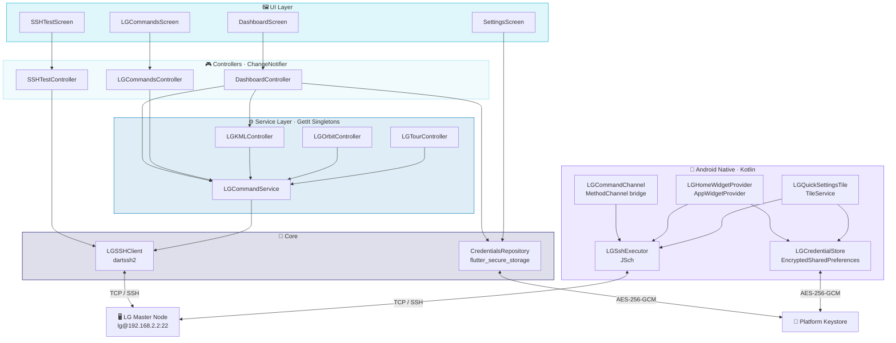
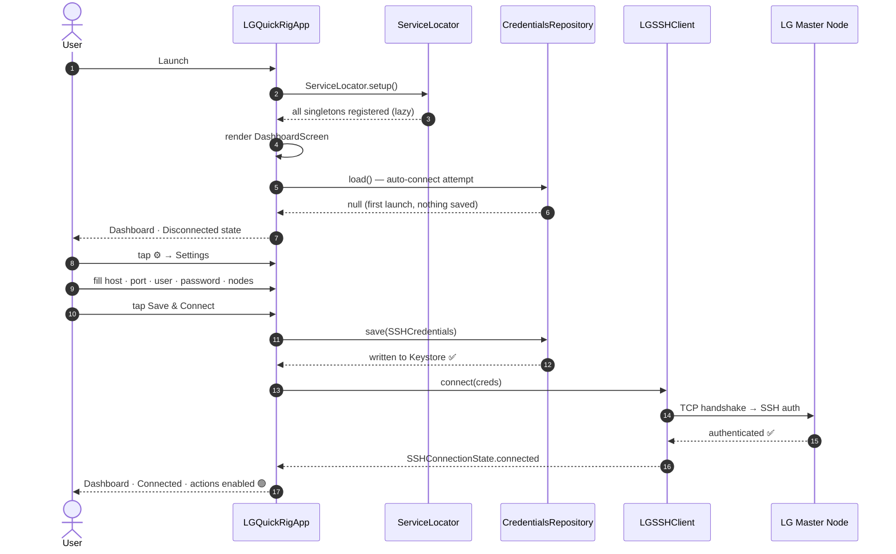
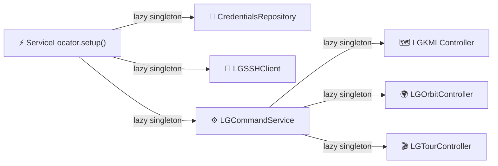

<div align="center">

```
██╗      ██████╗      ██████╗ ██╗   ██╗██╗ ██████╗██╗  ██╗██████╗ ██╗ ██████╗
██║     ██╔════╝     ██╔═══██╗██║   ██║██║██╔════╝██║ ██╔╝██╔══██╗██║██╔════╝
██║     ██║  ███╗    ██║   ██║██║   ██║██║██║     █████╔╝ ██████╔╝██║██║  ███╗
██║     ██║   ██║    ██║▄▄ ██║██║   ██║██║██║     ██╔═██╗ ██╔══██╗██║██║   ██║
███████╗╚██████╔╝    ╚██████╔╝╚██████╔╝██║╚██████╗██║  ██╗██║  ██║██║╚██████╔╝
╚══════╝ ╚═════╝      ╚══▀▀═╝  ╚═════╝ ╚═╝ ╚═════╝╚═╝  ╚═╝╚═╝  ╚═╝╚═╝ ╚═════╝
```

**Control your Liquid Galaxy cluster from your pocket.**<br/>
*No terminal. No SSH. One tap.*

<br/>

[](https://flutter.dev)
[](https://dart.dev)
[](https://developer.android.com)
[](https://flutter.dev/multi-platform/linux)
[](LICENSE)

<br/>

[](https://pub.dev/packages/dartssh2)
[](https://pub.dev/packages/flutter_secure_storage)
[](https://pub.dev/packages/get_it)
[](https://github.com/mwiede/jsch)
[](https://ai.google.dev)

<br/>

<table>
<tr>
<td align="center"><b>2 / 8</b><br/><sub>Weeks done</sub></td>
<td align="center"><b>4</b><br/><sub>Flutter screens</sub></td>
<td align="center"><b>5</b><br/><sub>Kotlin files</sub></td>
<td align="center"><b>2</b><br/><sub>Android surfaces</sub></td>
<td align="center"><b>0</b><br/><sub>Plaintext secrets</sub></td>
</tr>
</table>

</div>

<br/>

---

## What is LG QuickRig?

[**Liquid Galaxy**](https://www.liquidgalaxy.eu/) is an open-source panoramic display platform — 3 to 9 Linux machines running Google Earth in sync across a curved wall of screens. Magnificent to look at. Tedious to manage: every reboot, sync, or slave restart means cracking open a terminal and SSHing in by hand.

**LG QuickRig** removes that entirely.

- **One tap from your home screen** — a 4×1 Android widget puts Reboot, Sync, Shutdown, and Blank Screens on your launcher, no app open required
- **Quick Settings tile** — toggle connectivity straight from the system shade, with a live SSH ping confirming reachability
- **Full companion app** — Dashboard, LG Commands panel, SSH Console, and Settings, all wired to a shared SSH session that persists across screens
- **Coming:** AI voice commands, Gemini-powered log monitoring, anomaly detection, and a Linux desktop build

> The goal is a zero-friction rig operator's tool. If it takes more than one tap, it's too many.

<br/>

---

## 🎤 Presentation — June 17

> Talking points for the first project meeting. Seven topics you can go deep on or keep surface-level depending on the audience.

<br/>

<details>
<summary><b>1 · The problem this solves — and why it's not trivial</b></summary>

<br/>

Liquid Galaxy is impressive hardware — up to 9 synced displays running Google Earth — but the operator experience is stuck in the 90s. Every reboot, sync, or slave restart means opening a terminal, SSHing into the master node, and typing commands. On a shared rig this happens constantly.

The obvious solution is "just make an app." The non-obvious part is that the Android home screen widget and Quick Settings tile are processes completely separate from the app — they run inside the launcher and System UI respectively. You can't just call the Flutter engine from there. That process-isolation problem is what drove the entire Kotlin architecture in Week 2.

**One line version:** *"The hard part wasn't SSH — it was making SSH work from the home screen without the app being open."*

</details>

<details>
<summary><b>2 · Two SSH clients — why, and why that's the right call</b></summary>

<br/>

The app has two completely independent SSH implementations:

| | Where | Library | When it's used |
|:---|:---|:---|:---|
| **Dart side** | Flutter engine (main process) | `dartssh2` | App UI is open and running |
| **Kotlin side** | Widget / tile process | `JSch` | Home screen widget tap, QS tile ping |

The reason for two: Android App Widgets are `BroadcastReceiver`s running in the **launcher process**. Quick Settings tiles are bound services in **System UI**. Neither has access to the live Flutter engine or its SSH socket.

The alternatives — spinning up a background FlutterEngine, or using WorkManager to delegate back to Dart — add hundreds of milliseconds of startup latency and a lot of lifecycle complexity for a button that should feel instant.

JSch opens a fresh session per command, runs it, closes it. For fire-and-forget cluster operations (reboot, sync, blank screens) that's exactly right.

**One line version:** *"We have two SSH clients because Android's process model made one impossible."*

</details>

<details>
<summary><b>3 · The EncryptedSharedPreferences trick</b></summary>

<br/>

Credentials are saved by the Flutter Settings screen using `flutter_secure_storage`. On Android that means `EncryptedSharedPreferences` — a file named `"FlutterSecureStorage"` in the app's data directory, encrypted with a `MasterKey` stored in the Android Keystore under the alias `"_androidx_security_master_key"`.

`LGCredentialStore.kt` (the Kotlin credential reader for widgets/tiles) opens the **exact same file** using the **exact same key alias**. The Android Keystore returns the existing key when the alias matches — no new key is created — so both sides decrypt the same values without any cross-process credential passing, no duplicate storage, and no sync step.

This is non-obvious. Most people would introduce a separate storage mechanism or pass credentials through Intent extras (which is a security hole). Sharing the EncryptedSharedPreferences directly is the correct pattern and it's clean.

**One line version:** *"Dart writes the credentials, Kotlin reads them from the same encrypted file — no duplication, no passing secrets through Intents."*

</details>

<details>
<summary><b>4 · A real debugging story — the sudo TTY problem</b></summary>

<br/>

Reboot and shutdown weren't working even though the SSH connection was solid. The SSH Console screen (a raw command runner built into the app) was essential here — running `sudo reboot` directly showed:

```
[stderr] sudo: no tty present and no askpass program specified
```

The problem: `sudo` by default requires either a TTY (pseudo-terminal) to prompt for a password interactively, or `NOPASSWD` configured in sudoers. Our SSH sessions use `ChannelExec` (non-interactive), so no TTY is allocated. And the LG nodes don't have `NOPASSWD` for the `lg` user.

The fix is `sudo -S`, which tells sudo to read the password from stdin instead of a TTY:

```
echo 'password' | sudo -S reboot
```

The SSH Console was built exactly for moments like this — test commands directly against the live node, see raw output, debug without touching the app code. It paid off immediately.

**One line version:** *"The app has a built-in SSH console specifically so we can debug the LG node without leaving the tool."*

</details>

<details>
<summary><b>5 · How camera control works — query.txt vs KML NetworkLink</b></summary>

<br/>

There are two ways to move the Liquid Galaxy camera programmatically:

- **KML NetworkLink** — write a `gx:FlyTo` element to a KML file on the HTTP server and set up a NetworkLink that polls it. Requires per-installation configuration.
- **`/tmp/query.txt`** — write `flytoview=<LookAt>...</LookAt>` to this file on the master node. The LG process monitors it natively. No setup required.

`LGOrbitController` uses `query.txt`. It's the correct mechanism — it's what Google's original LG setup uses — but a lot of third-party apps use the NetworkLink approach because it's more documented. The `query.txt` approach works on a stock LG installation with zero configuration.

The 360° orbit is a `Timer.periodic` loop running every 400ms, incrementing the heading by 6° per step (60 steps × 6° = 360°), firing a new `flytoview` command each tick. The result is a smooth orbit around a geographic point.

**One line version:** *"The camera orbit writes 60 SSH commands over 24 seconds — one every 400ms — and the LG picks them up natively via a file it already watches."*

</details>

<details>
<summary><b>6 · Architecture decisions worth explaining</b></summary>

<br/>

Three choices that come up in Flutter architecture discussions:

**GetIt over Provider/Riverpod**
GetIt is a service locator, not a state management solution. It holds the SSH client singleton and resolves it anywhere without needing a `BuildContext`. Provider and Riverpod are excellent for widget state — they're overkill for "I need the same SSH connection in every screen." GetIt solves the exact right problem here.

**ChangeNotifier over Bloc/Riverpod**
The controllers (`DashboardController`, `LGCommandsController`) extend `ChangeNotifier` and are wrapped with `ListenableBuilder` in the UI. No generated code, no separate events/states, no boilerplate. For an app with simple state (connected/busy/error), the overhead of Bloc or Riverpod isn't justified. If the app grows to Week 6–7 complexity with async log streams and voice input, that call gets revisited.

**Layered service architecture**
`LGSSHClient` → `LGCommandService` → `LGKMLController / LGOrbitController` is a strict one-way dependency chain. Nothing at a higher layer imports something at a lower layer out of order. This means you can swap `LGSSHClient` (e.g., replace `dartssh2` with something else) without touching any controller.

**One line version:** *"The architecture is deliberately boring — the interesting engineering is in the SSH layer, not the state management."*

</details>

<details>
<summary><b>7 · Where it goes from here — Weeks 3–8</b></summary>

<br/>

The foundation (Weeks 1–2) is complete: SSH works, widgets work, credentials are secure, the architecture is clean. The remaining six weeks build on top:

| Milestone | What it unlocks |
|:---|:---|
| **Week 3** — Live Status widget (2×2) | Real-time connection state on the home screen without opening the app |
| **Week 4** — Linux desktop build | The same Flutter codebase compiles to a native Linux window for use on the LG operator machine |
| **Week 5** — Gemini voice commands | Speak to the rig: *"fly to the Eiffel Tower"* → SSH command sent |
| **Week 6** — Log monitoring | Gemini reads the LG system logs over SSH and flags anomalies before they become incidents |
| **Weeks 7–8** — Polish + submission | Tests, docs, demo video |

The AI weeks are the project's headline feature. Everything built in Weeks 1–2 is infrastructure that makes those weeks possible without scrambling.

**One line version:** *"Weeks 1 and 2 are the foundation. Weeks 5 and 6 are why the project is interesting."*

</details>

<br/>

---

## App Preview

<div align="center">

*Dark teal · Material 3 · Dashboard + LG Commands*

</div>

```
╔═══════════════════════════════════════════╗   ╔═══════════════════════════════════════════╗
║  LG QuickRig          ● Connected  ⚙      ║   ║  LG Commands             ● Connected      ║
╠═══════════════════════════════════════════╣   ╠═══════════════════════════════════════════╣
║                                           ║   ║  ┌─────────────────────────────────────┐  ║
║  ┌─────────────────────────────────────┐  ║   ║  │  ✓ Connected — ready to send cmds  │  ║
║  │ Connection                          │  ║   ║  └─────────────────────────────────────┘  ║
║  │ lg@192.168.2.2  ·  3 nodes          │  ║   ║                                           ║
║  │ ┌─────────────────────────────────┐ │  ║   ║  Commands                                 ║
║  │ │           Disconnect            │ │  ║   ║  ┌───────────────┐  ┌───────────────────┐ ║
║  └─────────────────────────────────────┘  ║   ║  │  ↺  Reboot    │  │  ⏻  Shutdown      │ ║
║                                           ║   ║  └───────────────┘  └───────────────────┘ ║
║  Quick Actions                            ║   ║  ┌───────────────┐  ┌───────────────────┐ ║
║  ┌───────────────┐  ┌───────────────────┐ ║   ║  │  ⇄  Sync      │  │  ↻  Restart Slaves│ ║
║  │  ↺  Reboot    │  │  ↻  Restart Svcs  │ ║   ║  └───────────────┘  └───────────────────┘ ║
║  └───────────────┘  └───────────────────┘ ║   ║  ┌───────────────┐                        ║
║  ┌───────────────┐  ┌───────────────────┐ ║   ║  │  ▣  Blank Scrn│                        ║
║  │  ⏻  Shutdown  │  │  ⇄  Sync          │ ║   ║  └───────────────┘                        ║
║  └───────────────┘  └───────────────────┘ ║   ║                                           ║
║  ┌───────────────┐  ┌───────────────────┐ ║   ║  Output                         [Clear]   ║
║  │  ▣  Blank Scrn│  │  🗑  Clean KML    │ ║   ║  ┌─────────────────────────────────────┐  ║
║  └───────────────┘  └───────────────────┘ ║   ║  │ 14:32:01 [OUT] Running: Sync…       │  ║
║  ┌───────────────┐  ┌───────────────────┐ ║   ║  │ 14:32:02 [OUT] Sync completed.      │  ║
║  │  ⌨  LG Cmds  │  │  >_  SSH Console  │ ║   ║  └─────────────────────────────────────┘  ║
║  └───────────────┘  └───────────────────┘ ║   ╚═══════════════════════════════════════════╝
╚═══════════════════════════════════════════╝
```

```
╔══════════════════════════════════════════════════════════╗
║  Android Home Screen                                     ║
║                                                          ║
║  ┌──────────────────────────────────────────────────┐   ║
║  │  LG QuickRig                                     │   ║
║  │  ┌──────────┐ ┌──────────┐ ┌──────────┐ ┌─────┐ │   ║
║  │  │ ↺ Reboot │ │ ⇄  Sync  │ │ ⏻ Shutdn │ │ ▣   │ │   ║
║  │  └──────────┘ └──────────┘ └──────────┘ └─────┘ │   ║
║  └──────────────────────────────────────────────────┘   ║
║         Command Bar widget  (4×1)                        ║
╚══════════════════════════════════════════════════════════╝
```

<br/>

---

## Roadmap

<div align="center">

`Progress ████████████░░░░░░░░░░░░░░░░░░  2 of 8 weeks`

</div>

<br/>

| | Week | Focus | Shipped |
|:---:|:---:|:---|:---|
| ✅ | **1** | **SSH Foundation** | `LGSSHClient` · `LGCommandService` · secure credential storage · Dashboard · LG Commands · SSH Console |
| ✅ | **2** | **Android Widgets + Platform Channels** | `LGCommandChannel.kt` · `LGCredentialStore.kt` · `LGSshExecutor.kt` (JSch) · Command Bar widget (4×1) · Quick Settings tile |
| 🔜 | **3** | **Live Status Widget + Background Service** | Live Status widget (2×2) · `LGWidgetService` background Flutter engine · real-time SSH state |
| 🔜 | **4** | **Linux Desktop Build** | `linux/` runner · desktop UI polish · Debian/Ubuntu packaging |
| 🔜 | **5** | **AI Voice Commands** | Speech-to-SSH pipeline · Gemini API wiring · natural-language cluster control |
| 🔜 | **6** | **Log Monitoring + Anomaly Detection** | Gemini-powered SSH log analysis · anomaly alerts · adaptive widget layout |
| 🔜 | **7** | **Testing + Polish** | Unit · integration · widget tests · UI refinements · edge-case hardening |
| 🔜 | **8** | **Docs + Submission** | Final docs · demo video · submission-ready release |

<br/>

---

## Architecture

Two SSH paths coexist by design — the Flutter engine owns the live session for the app UI, while Kotlin handles widget and tile operations independently using JSch so they work even when the app isn't running.



<br/>

---

## First-launch Flow



<br/>

---

## Project Structure

```
lg_quickrig/
│
├── 📱 android/app/src/main/
│   ├── AndroidManifest.xml          ← INTERNET · widget receiver · QS tile service
│   ├── kotlin/…/
│   │   ├── MainActivity.kt          ← wires LGCommandChannel on engine start
│   │   └── lg/
│   │       ├── LGCommandChannel.kt     ← MethodChannel: Dart ↔ Kotlin bridge
│   │       ├── LGCredentialStore.kt    ← reads EncryptedSharedPreferences (same store as Dart)
│   │       ├── LGSshExecutor.kt        ← JSch SSH client for widget/tile use
│   │       ├── LGHomeWidgetProvider.kt ← AppWidgetProvider — 4 buttons, PendingIntent routing
│   │       └── LGQuickSettingsTile.kt  ← TileService — ping-based connect/disconnect toggle
│   └── res/
│       ├── xml/lg_home_widget_info.xml   ← AppWidgetProviderInfo (4×1, 300dp)
│       ├── layout/lg_home_widget.xml     ← Command Bar: Reboot · Sync · Shutdown · Blank
│       └── values/strings.xml            ← app_name, widget_description, qs_tile_label
│
├── 🐧 linux/                        ← Linux desktop runner (Week 4)
│
├── 📦 lib/
│   ├── main.dart                    ← async init · WidgetsFlutterBinding · DI setup
│   ├── app.dart                     ← MaterialApp · dark teal theme · home=Dashboard
│   │
│   ├── 🔩 core/
│   │   ├── constants.dart           ← LGDefaults (host, port, timeouts, retries)
│   │   ├── di/service_locator.dart  ← GetIt wiring — single source of truth for all services
│   │   └── ssh/
│   │       ├── ssh_client.dart      ← LGSSHClient — transport, retry, state stream
│   │       ├── ssh_credentials.dart ← value object: host / port / user / pass / nodeCount
│   │       └── ssh_exception.dart   ← LGSSHException
│   │
│   ├── 💾 data/repositories/
│   │   └── credentials_repository.dart  ← flutter_secure_storage CRUD
│   │
│   ├── ⚙️  services/
│   │   ├── lg_command_service.dart  ← execute · executeOnSlave · system commands
│   │   ├── lg_kml_controller.dart   ← sendKML · cleanKML · addKMLReference
│   │   ├── lg_orbit_controller.dart ← flyTo · orbitPlay · orbitStop
│   │   └── lg_tour_controller.dart  ← startTour · stopTour · exitTour
│   │
│   ├── 🖼️  features/
│   │   ├── dashboard/
│   │   │   ├── dashboard_controller.dart  ← auto-connect · quick-action dispatch
│   │   │   └── dashboard_screen.dart      ← connection card + 8-tile action grid
│   │   ├── lg_commands/
│   │   │   ├── lg_commands_controller.dart ← command dispatch + nav + orbit + output log
│   │   │   └── lg_commands_screen.dart     ← buttons · nav pad · camera panel · log
│   │   ├── ssh_test/
│   │   │   ├── ssh_test_controller.dart   ← log management · DI-aware
│   │   │   └── ssh_test_screen.dart       ← raw SSH console · timestamped output
│   │   └── settings/
│   │       └── settings_screen.dart       ← self-loading form · secure persistence
│   │
│   └── 🧩 shared/widgets/
│       └── connection_status_badge.dart   ← coloured pill: Disconnected / Connecting / Connected
│
└── 🧪 test/
    └── widget_test.dart             ← smoke: Dashboard renders disconnected on launch
```

<br/>

---

## Tech Stack

<div align="center">

| Layer | Technology | What it does |
|:---:|:---:|:---|
|  | **Flutter 3.38** | Cross-platform UI — Android + Linux from a single codebase |
|  | **Dart 3.10** | Null-safe, async-first application logic |
|  | **Kotlin** | Platform channels, App Widgets, Quick Settings tile |
|  | **dartssh2 ^2.9** | Pure-Dart SSH2 — no JNI, no native libs, no C bridge |
|  | **JSch 0.1.55** | Java SSH for Kotlin widget/tile operations (no Flutter engine needed) |
|  | **flutter\_secure\_storage ^9.2** | Hardware-backed encryption via Keystore / Keychain / libsecret |
|  | **get\_it ^8.0** | Zero-codegen service locator — resolve anywhere, no BuildContext |
|  | **ChangeNotifier** | Reactive UI without extra state management packages |
|  | **Gemini API** | *(Week 5+)* Voice commands, log analysis, anomaly detection |

</div>

<br/>

---

## Getting Started

### Prerequisites

```
Flutter ≥ 3.16     flutter pub get    ✓
Android SDK API 23+                   ✓   minSdk enforced in build.gradle.kts
LG master node reachable over LAN     ✓   SSH port 22 open, sudo -S supported
```

### Install & run

```bash
git clone https://github.com/your-org/lg-quickrig.git
cd lg-quickrig
flutter pub get

flutter run            # Android device / emulator
flutter run -d linux   # Linux desktop window
```

### First launch in 4 steps

```
  ① Open the app
     └─► Dashboard shows Disconnected (no credentials saved yet)
             │
  ② Tap ⚙  Settings
     └─► Form opens, pre-filled with defaults
             │
  ③ Enter your LG details
     └─► Host: 192.168.2.2   Port: 22
         Username: lg          Password: ••••••
         Node count: 3
             │
  ④ Tap "Save & Connect"
     └─► Credentials → Keystore ✓
         SSH handshake → authenticated ✓
         Status badge → 🟢  Quick Actions → enabled
```

**To add the home screen widget:** long-press your launcher → Widgets → LG QuickRig → drag a 4×1 slot.

**To add the Quick Settings tile:** pull down the shade → edit tiles → add *LG QuickRig*.

<br/>

---

## SSH Module

### Retry & reconnect

`LGSSHClient.connect()` retries up to `maxRetries` times with a configurable delay. Wrong-password errors are detected as `SSHAuthAbortError` and fail immediately — no point waiting through retries for a credential problem.

```
Attempt 1 ──► network error        Attempt 1 ──► SSHAuthAbortError
   ⏱ 2 s                              │
Attempt 2 ──► network error           └── LGSSHException thrown immediately
   ⏱ 2 s                                  (wrong password — no retries)
Attempt 3 ──► timeout
   └── LGSSHException thrown
```

### Zero-polling disconnect detection

When the LG node drops the connection — immediately after `sudo reboot`, for example — `LGSSHClient` listens on the raw client's `done` future and transitions to `SSHConnectionState.disconnected` without any timer or polling loop. The status badge turns red the instant the socket closes.

### Execute a command

```dart
final output = await lgSSHClient.executeCommand(
  'df -h /',
  timeout: Duration(seconds: 30),
);
// stdout — or "[stderr] …" prefix when only stderr is non-empty
```

<br/>

---

## Service Layer

### Predefined commands — `LGCommandService`

`LGCommandService` wraps `LGSSHClient` with cluster-aware helpers. `executeOnSlave` SSH-hops from the master to any slave using the same stored password. System commands handle teardown order automatically — slaves first, master last — so the HTTP server that slaves poll is always the last thing to go down.

```dart
await cmd.reboot();           // slaves N→2 then master; connection drops — expected
await cmd.shutdown();         // same descending order
await cmd.restartServices();  // pkill chrome + lg-relaunch on every node
await cmd.sync();             // ~/bin/lg-sync on master
await cmd.blankScreens();     // empty KML to each slave + clear kmls.txt
await cmd.moveUp();           // xdotool keydown/up Up  (500 ms hold)
await cmd.rotateLeft();       // xdotool ctrl+Left
```

### KML management — `LGKMLController`

Writes and removes KML files on the master's built-in HTTP server. The cluster browser stack polls `kmls.txt` for URLs to load. UI surface planned for a later week.

### Camera control — `LGOrbitController`

Sends `flytoview=<LookAt>` directly to `/tmp/query.txt` — the native LG mechanism for live camera commands. No NetworkLink setup required. Supports fly-to and a 360° orbit animation (60-step, timer-driven). UI surface is the LG Commands screen navigation pad.

### Tour control — `LGTourController`

Writes `gplaytour=NAME` to `~/gs_cmd`, which the `gsync` watcher on the master picks up to start and stop KML tours. UI surface planned for a later week.

<br/>

---

## Dependency Injection

All services are **lazy singletons** — created on first access, alive for the entire app lifetime. The SSH session is never dropped and reopened as screens are pushed and popped: the same `LGSSHClient` instance serves every controller.



```dart
// Resolve anywhere — no BuildContext, no Provider tree
final client = sl<LGSSHClient>();
final cmd    = sl<LGCommandService>();
```

> **Rule:** a controller that receives a singleton via `sl<T>()` must **never** call `.dispose()` on it. Ownership stays with `ServiceLocator` for the app's lifetime.

<br/>

---

## Credential Security

> 🔐 Five fields. One encrypted enclave. Zero plaintext on disk — ever.

```
  User enters credentials in Settings
           │
           ▼
  CredentialsRepository.save(SSHCredentials)
           │
           ├─ 🤖  Android ───► EncryptedSharedPreferences
           │                    Android Keystore  ·  AES-256-GCM
           │                    hardware-backed on API 23+ devices
           │
           ├─ 🍎  iOS ──────►  Keychain Services
           │                    hardware-backed on Secure Enclave devices
           │
           └─ 🐧  Linux ────►  libsecret / GNOME keyring
                               encrypted-file fallback if no keyring daemon
```

The Kotlin `LGCredentialStore` opens the **same** `EncryptedSharedPreferences` file (`"FlutterSecureStorage"`) using the **same** master key alias (`"_androidx_security_master_key"`) that `flutter_secure_storage` creates. Android Keystore returns the existing key on alias match — so both sides share the enclave with zero duplication and zero cross-process credential passing.

<br/>

---

## Android Platform Channels

Android App Widgets and Quick Settings tiles live in the launcher process or a bound service — separate from the Flutter engine. Rather than spinning up a background engine for every button tap, widget and tile operations call `LGSshExecutor` (JSch) directly. The `MethodChannel` bridge remains available for when the main engine is live and Dart code needs to call native operations.

```
┌──────────────────────┐     MethodChannel (main engine)    ┌─────────────────────────┐
│  Running Flutter app │  ◄─────────────────────────────►  │  LGCommandChannel.kt    │
│  (main process)      │  "com.liqtech.lg_quickrig/commands"│  → LGSshExecutor        │
└──────────────────────┘                                    └─────────────────────────┘

┌──────────────────────┐     PendingIntent → BroadcastReceiver
│  Home screen widget  │  ──────────────────────────────────► LGHomeWidgetProvider
│  (launcher process)  │                                        ├─ LGCredentialStore
└──────────────────────┘                                        └─ LGSshExecutor (JSch)

┌──────────────────────┐     onStartListening / onClick
│  Quick Settings tile │  ──────────────────────────────────► LGQuickSettingsTile
│  (System UI process) │                                        ├─ LGCredentialStore
└──────────────────────┘                                        └─ LGSshExecutor.ping()
```

**Widget button tap flow:**

```
Tap → PendingIntent → LGHomeWidgetProvider.onReceive()
        │  goAsync() extends receiver lifetime to ~30–60 s
        ├─ LGCredentialStore.load()    reads EncryptedSharedPreferences
        └─ LGSshExecutor.execute()     opens JSch session, runs command, closes
                │
                └─ AppWidgetManager.updateAppWidget()   shows result in widget
```

**Quick Settings tile:** pings the LG node on `onStartListening()` and sets `STATE_ACTIVE` (teal, reachable), `STATE_INACTIVE` (grey), or `STATE_UNAVAILABLE` (spinner, ping in flight). Tapping when unconfigured opens the main app's Settings screen.

<br/>

---

## Liquid Galaxy Command Reference

<details>
<summary>🖥️ &nbsp;System management</summary>

```bash
# Reboot master — SSH drops immediately, that's expected
echo 'password' | sudo -S reboot

# Reboot a slave via ssh-from-master
sshpass -p lg ssh -t -o StrictHostKeyChecking=no lg@lg2 "echo 'lg' | sudo -S reboot"

# Shut down the entire cluster
echo 'password' | sudo -S shutdown -h now

# Restart browser stack on a node
export DISPLAY=:0; pkill -9 chrome; sleep 2; ~/bin/lg-relaunch

# Sync content master → all slaves
~/bin/lg-sync
```

</details>

<details>
<summary>🩺 &nbsp;Diagnostics</summary>

```bash
# All LG-related processes
ps aux | grep -E 'chrome|earth|lg'

# Disk space on master
df -h /

# Ping slave 2
ping -c 3 lg2

# Slave SSH connectivity check
sshpass -p lg ssh lg@lg2 'hostname && uptime'
```

</details>

<br/>

---

## Contributing

```bash
git checkout -b feat/your-feature
# make changes
flutter analyze    # must show: No issues found
flutter test       # must show: All tests passed
# open PR → main
```

### Adding a new cluster command

```
1. lib/services/lg_command_service.dart          ← add the method
2. lib/features/dashboard/dashboard_controller.dart  ← _runAction('Label', cmd.yourMethod)
3. lib/features/dashboard/dashboard_screen.dart  ← _TileConfig entry in _QuickActionsGrid
4. lib/features/lg_commands/ (controller + screen) ← button in _CommandButtons
5. Destructive? → route through _confirmAndRun() / _confirmThenRun()
```

### Adding a new service

New services take `LGCommandService` as a constructor parameter — never `LGSSHClient` directly. Register as a lazy singleton in `lib/core/di/service_locator.dart` following the existing chain.

<br/>

---

## License

MIT License · Copyright (c) 2026 LG QuickRig Contributors

Permission is hereby granted, free of charge, to any person obtaining a copy of this software and associated documentation files (the "Software"), to deal in the Software without restriction, including without limitation the rights to use, copy, modify, merge, publish, distribute, sublicense, and/or sell copies of the Software, and to permit persons to whom the Software is furnished to do so, subject to the following conditions: The above copyright notice and this permission notice shall be included in all copies or substantial portions of the Software. The software is provided "as is", without warranty of any kind.

<br/>

---

<div align="center">

**Built with Flutter · dartssh2 · JSch · Gemini · Platform Keystore**

<br/>

[](https://flutter.dev)
&nbsp;
[](https://pub.dev/packages/dartssh2)
&nbsp;
[](https://ai.google.dev)
&nbsp;
[](https://pub.dev/packages/flutter_secure_storage)

<br/>

*Liquid Galaxy is an open-source project by the Liquid Galaxy community.*
*LG QuickRig is an independent tool — not affiliated with Google.*

<br/>

**⭐ Star this repo if it saved you an SSH session**

</div>
